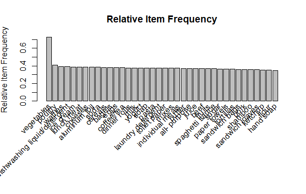
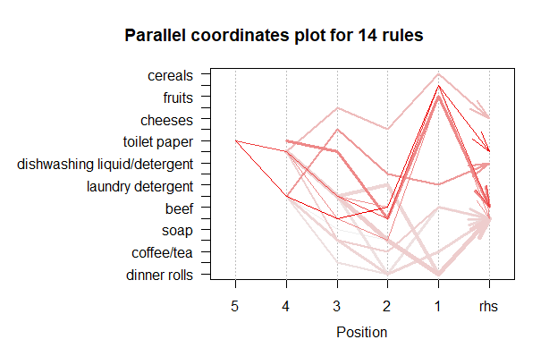

# Market Basket Analysis

The Association Rules algorithm is also called Market Basket Analysis as has been applied
mostly to learn about purchasing patterns, even if it can be applied to find
patterns in many other cases. 

## Objective :
The objective of the project is to find items that are frequently bought together to be able:
- Place frequently bought together items nearby to increase sales on-site
- Increase online revenue by offering related items to the user
- Creating promotional campaigns with those items which were
bought together.

## Getting Started :
### Import Required libraries
To run the code the following libraries are needed:
```r
library(tidyr)
library(dplyr)
library(ggplot2)
library(stringr)
library(lubridate)
library(anytime)
library(plyr)
library(arules)
library(BayesLCA)
library(arulesViz)
library(reshape2)
library(sjmisc)
library(cowplot)
library(RColorBrewer)
```
### Import the Dataset

```r
groceries <- read.table("Groceries.csv", head=FALSE, stringsAsFactors = FALSE, 
                         sep = ",", strip.white = TRUE, blank.lines.skip = TRUE, 
                         col.names = paste0("V",seq_len(34)), fill = TRUE, 
                         na.strings="NA")
```

## Data Cleaning :
The `Groceries.csv` file is a comma-separated csv file with 1499 transactions and a maximum
of 34 items per transaction.
Some data cleaning was performed :
- The white spaces have been trimmed, the empty rows ignored and the NA values
marked as NA when importing to R.
- The date, which was concatenated with the first item, was split and removed as is not
needed (date range: January 2000 to February 2002, 28 months).
- The transactionID was added for each transaction.

The Apriori algorithm needs transactional data which can be shaped in two formats: basket
or single. The basket format contains a transaction per line with the items separated by
commas in one column. The single format contains two columns, the first column is the
transaction ID and the second is an item. In both cases, the duplicates were removed to
ensure the same item is not twice in a transaction. Both formats have been tested, with the
same results. The basket format can also use a binary matrix, but has
not been tested.

```r
groceries_clean <- groceries %>%
  separate(col = V1,
           into = c("date","product_1"),
           sep = "(?<=[0-9])(?=[A-Za-z])"
           )

groceries_clean <- groceries_clean %>% dplyr::rename("V1" = "product_1")
groceries_clean$transactionID <- seq.int(nrow(groceries_clean))
str(groceries_clean)

# PROCESSING DATA FRAME
groceries_items <- select(groceries_clean,-c("date"))
str(groceries_items)
groceries_items_single <- melt(groceries_items, id = "transactionID")
subset(groceries_items_single, transactionID == 1)
groceries_items_single <- select(groceries_items_single,-c("variable"))
count(unique(groceries_items_single$value))
groceries_items_single <- groceries_items_single[-which(groceries_items_single$value == ""), ]
sapply(groceries_items_single, function(x) sum(is.na(x)))
sum(is.na(groceries_items_single))
groceries_items_single[!complete.cases(groceries_items_single), ]
count(unique(groceries_items_single$value))
str(groceries_items_single)
write.csv(groceries_items_single, "data/groceries_items_single.csv", row.names = FALSE)

groceries_transactions <- read.transactions(file = "data/groceries_items_single.csv",
                                            format = "single",
                                            sep = ",",
                                            header = TRUE,
                                            rm.duplicates = TRUE,
                                            cols = c("transactionID","value"))

class(groceries_transactions)
str(groceries_transactions)
```

## Transactional Data Exploration :
The data frame has been successfully transformed into transactional, the number of
transactions (1,499) and items (38) is exactly the same as before the transformation as seen
in the summary. 38.36% of the cells from the sparse matrix are filled in with products and the rest are empty.

The items within the transactions seem to be evenly distributed and the size of the transactions normally distributed. 50% of the transactions contain between 10 and 19 items, the minimum number of unique items within a transaction are 4 and the
maximum 27.

The most popular items are vegetables which appear in 1,089 transactions (72.64%),
followed by poultry which appears in 613 transactions (40.89%).

```
> summary(groceries_transactions)
transactions as itemMatrix in sparse format with
 1499 rows (elements/itemsets/transactions) and
 38 columns (items) and a density of 0.3836242 

most frequent items:
                  vegetables                      poultry                      waffles 
                        1089                          613                          587 
dishwashing liquid/detergent                    ice cream                      (Other) 
                         585                          584                        18394 

element (itemset/transaction) length distribution:
sizes
  4   5   6   7   8   9  10  11  12  13  14  15  16  17  18  19  20  21  22  23  24  25  26  27 
 15  57  56  53  71  74  72  79  67  72  89  86  84 105  95  94 114  78  67  36  24   7   3   1 

   Min. 1st Qu.  Median    Mean 3rd Qu.    Max. 
   4.00   10.00   15.00   14.58   19.00   27.00 

includes extended item information - examples:
         labels
1  all- purpose
2 aluminum foil
3        bagels

includes extended transaction information - examples:
  transactionID
1             1
2            10
3           100
```

```r
inspect(groceries_transactions)
length(groceries_transactions)
items(groceries_transactions)
freq_abs <- itemFrequency(groceries_transactions, type = "absolute")
freq_abs <- freq_abs %>% sort(decreasing = TRUE)
freq_abs

# Creating Plot
itemFrequencyPlot(groceries_transactions,type="absolute",
                  main="Absolute Item Frequency", ylab = "Absolute Item Frequency", topN = 38)
freq_rel <- itemFrequency(groceries_transactions, type = "relative")
freq_rel <- freq_rel %>% sort(decreasing = TRUE)
freq_rel

itemFrequencyPlot(groceries_transactions,type="relative",
                  main="Relative Item Frequency", ylab = "Relative Item Frequency", topN = 38)

size_transactions <- data.frame(size = size(groceries_transactions))
head(size_transactions)
summary(size_transactions)

density_transactions <- ggplot(size_transactions, aes(x = size)) +
  geom_density(fill = "grey", alpha = 0.2) +
  labs(x = "Number of Items per Transaction", y = "Density") +
  theme_bw()

hist_transactions <- ggplot(size_transactions, aes(x = size)) +
  geom_histogram(fill = "grey", alpha = 0.5) +
  labs(x = "Number of Items per Transaction", y = "Number of Transactions") +
  theme_bw()
plot_grid(density_transactions, hist_transactions, labels = "AUTO")
image(sample(groceries_transactions,100))
```





## Item sets

When setting the support to 0.01, the confidence to 0.8 and the minimum number of items
within a set to 2, the result is 1,071,312 of item sets. As vegetables appear in 72.64%
of the transaction the decision is to take vegetables out of the picture and evaluate the rest of the items, which result in 619,710 item sets.

As there are still many item sets to evaluate, the result is restricted to have a minimum 3 items in the item set, the total number then reduces to 619,044 item sets.

```r
groceries_apriori_items <- apriori(groceries_transactions,parameter=list(support=0.01,confidence=0.8,minlen=2, target = "frequent item sets"))

groceries_apriori_items <- sort(groceries_apriori_items,by="support", decreasinfg = TRUE)

summary(groceries_apriori_items)

inspect(head(groceries_apriori_items, 10))

groceries_apriori_items_non_veg <- apriori(groceries_transactions,
                                           parameter=list(support=0.01,confidence=0.8,minlen=2, target = "frequent item sets"),
                                           appearance = list(none = "vegetables"))

groceries_apriori_items_non_veg <- sort(groceries_apriori_items_non_veg,by="support", decreasing = TRUE)

inspect(head(groceries_apriori_items_non_veg, 10)) 

groceries_apriori_items_non_veg_3 <- apriori(groceries_transactions,
                                             parameter=list(support=0.01,confidence=0.8,minlen=2, target = "frequent item sets"),
                                             appearance = list(none = "vegetables"))

groceries_apriori_items_non_veg_3 <- sort(groceries_apriori_items_non_veg_3,by="support", decreasing = TRUE)
summary(groceries_apriori_items_non_veg_3)
inspect(head(groceries_apriori_items_non_veg_3, 10))
```

```
Apriori

Parameter specification:
 confidence minval smax arem  aval originalSupport maxtime support minlen maxlen target  ext
        0.8    0.1    1 none FALSE            TRUE       5    0.01      3     10  rules TRUE

Algorithmic control:
 filter tree heap memopt load sort verbose
    0.1 TRUE TRUE  FALSE TRUE    2    TRUE

Absolute minimum support count: 14 

set item appearances ...[1 item(s)] done [0.00s].
set transactions ...[38 item(s), 1499 transaction(s)] done [0.00s].
sorting and recoding items ... [37 item(s)] done [0.00s].
creating transaction tree ... done [0.00s].
```

## Rules and Interest Measures

```r
groceries_apriori_rules <- apriori(groceries_transactions,
                                   parameter=list(support=0.01,confidence=0.8,minlen=3, target = "rules"),
                                   appearance = list(none = "vegetables"))

summary(groceries_apriori_rules) # most of the rules contain 6 items

groceries_apriori_rules_1 <- apriori(groceries_transactions,
                                     parameter=list(support=0.02,confidence=0.8,minlen=3, target = "rules"),
                                     appearance = list(none = "vegetables"))

summary(groceries_apriori_rules_1)  # now there are only 14 rules left

inspect(groceries_apriori_rules_1)

length(groceries_apriori_rules_1)

cbind(as(groceries_apriori_rules_1, "data.frame"), conviction=interestMeasure(groceries_apriori_rules_1, "conviction", groceries_transactions))

interestMeasure(groceries_apriori_rules_1, c("leverage", "collectiveStrength"), 
                transactions = groceries_transactions)

plot(groceries_apriori_rules_1, jitter = 0)

plot(groceries_apriori_rules_1, measure=c("support", "lift"), shading="confidence")

plotly_arules(groceries_apriori_rules_1)

plot(groceries_apriori_rules_1, method = "graph", main = "Graph for 14 rules - Interaction between Items")

plot(groceries_apriori_rules_1, method = "paracoord")

plot(sort(groceries_apriori_rules_1, by="lift"), method="grouped", 
     main = "Grouped Matrix for the 14 rules")

plot(groceries_apriori_rules_1, method="graph", measure = "support", engine="htmlwidget",
     shading = "lift", control = list(verbose = TRUE))
plot(groceries_apriori_rules_1, method="matrix", measure="support")

rules_lift_2_2 <- subset(groceries_apriori_rules_1, subset = lift > 2.2)

inspect(rules_lift_2_2)

write(rules_lift_2_2, file = "data/rules_lift_2_2.csv", sep = ",", quote = TRUE, row.names = FALSE)

rule_1 <- rules_lift_2_2[1,]
plot(rule_1, method = "doubledecker", data = groceries_transactions, main = "Doubledecker for Rule 1")

rule_2 <- rules_lift_2_2[2,]
plot(rule_2, method = "doubledecker", data = groceries_transactions, main = "Doubledecker for Rule 2")


# APRIORI ALGORITHM 
# CREATING RULES - BEEF- RULE 1 FROM LATEST SUBSET

rules_spaghetti_sauce <- arules::subset(groceries_apriori_rules_1, 
                                        subset = items %ain% c("spaghetti sauce"))

inspect(rules_spaghetti_sauce)

rules_beef <- arules::subset(groceries_apriori_rules_1, 
                             subset = items %ain% c("beef"))

inspect(rules_beef)

rules_sugar <- arules::subset(groceries_apriori_rules_1, 
                              subset = items %ain% c("sugar"))

inspect(rules_sugar)

rules_bagels <- arules::subset(groceries_apriori_rules_1, 
                               subset = items %ain% c("bagels"))

inspect(rules_bagels)

rules_toilet_paper <- arules::subset(groceries_apriori_rules_1, 
                                     subset = items %ain% c("toilet paper" ))

inspect(rules_toilet_paper)

rules_poultry <- arules::subset(groceries_apriori_rules_1, 
                                subset = items %ain% c("poultry" ))

inspect(rules_poultry)

rules_beef_all_after <- apriori(groceries_transactions, parameter = list(supp = 0.02, conf = 0.8,minlen=2),
                                appearance = list(default = "lhs", rhs = "beef"))

inspect(rules_beef_all_after)

groceries_items_basket <- select(groceries_clean,-c("date","transactionID"))

str(groceries_items_basket)

colnames(groceries_items_basket)

write.csv(groceries_items_basket,"data/groceries_items_basket.csv", row.names = FALSE)

groceries_transactions_basket <- read.transactions(file = "data/groceries_items_basket.csv",
                                                   format = "basket",
                                                   sep = ",",
                                                   header = TRUE,
                                                   rm.duplicates = TRUE)

class(groceries_transactions_basket)
str(groceries_transactions_basket)
summary(groceries_transactions_basket)

inspect(groceries_transactions_basket)
length(groceries_transactions_basket)
items(groceries_transactions_basket)
```

With support of 0.01, confidence of 0.8, a minimum length of 3 items per item set and
excluding vegetables the Apriori algorithm generate 9,660 rules. The support is then modified to 0.02 and rules reduce to 14.

### Support
Supports refers to how many times the combination of items or itemset occurs in the
dataset. So for support of 0.02, the item set needs to appear in 29.98 transactions (0.02 * 1,499). Taking into consideration that in the data set there is an average of 53.53 transactions per month (1,499 / 28 months), 29.98 transactions can be considered relevant.

### Confidence
Confidence refers to the probability of the item B being part of the itemset if another item A is present. In the default setting the confidence is set as 0.8, B needs to appear in a minimum of 80% of the item sets which contain A. The objective is generating a rule where both items appear most of the time together.

### Lift
The lift can be defined, confidence divided the expected confidence. When support is higher than confidence then lift is negative correlated, and vice versa. If confidence is equal to support then the lift is 1, which means that the items are independent. If the items are independent it won’t be possible to create any rule.

In this case, the goal is to have a lift higher than 1 (and the higher the better), which imply a positive relationship, and high confidence that the items appear most of the times together.

$$ Support = \frac{Number of transactions with both A and B}{Total numbers of transaction} = P(A \cap B) $$

$$ Confidence = \frac{Number of transactions with both A and B}{Total numbers of transaction with A} = \frac{P(A \cap B)}{P(A)} $$

$$ Expected Confidence = \frac{Number of Transactions with B}{Total numbers of transaction} = P(B) $$

$$ Lift = \frac{Confidence}{ExpectedConfidence} = \frac{P(A \cap B)}{P(A).P(B)} $$

<br>
<br>

## Plots





